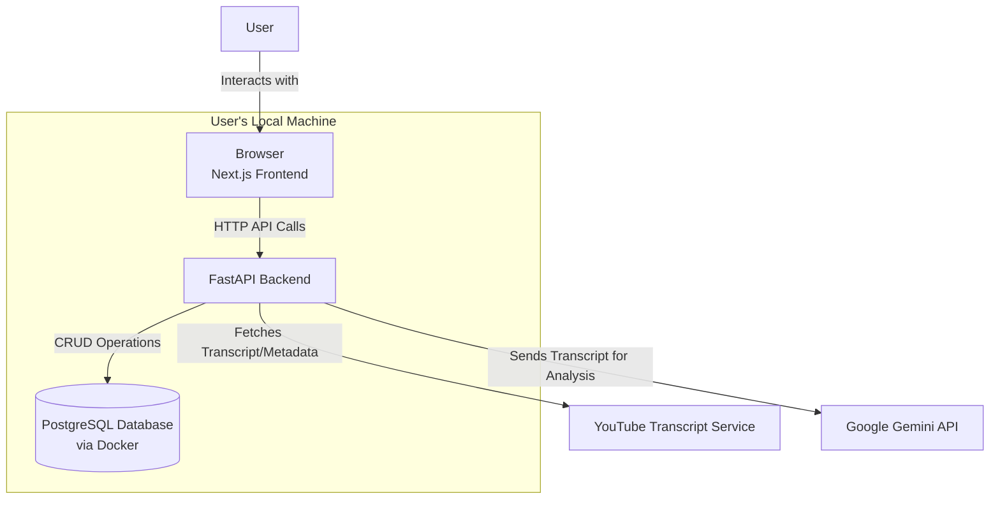
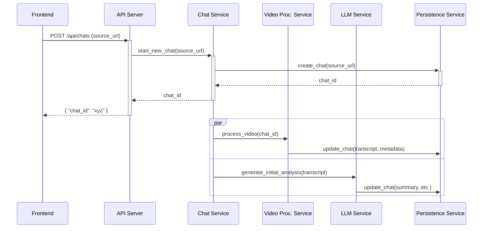
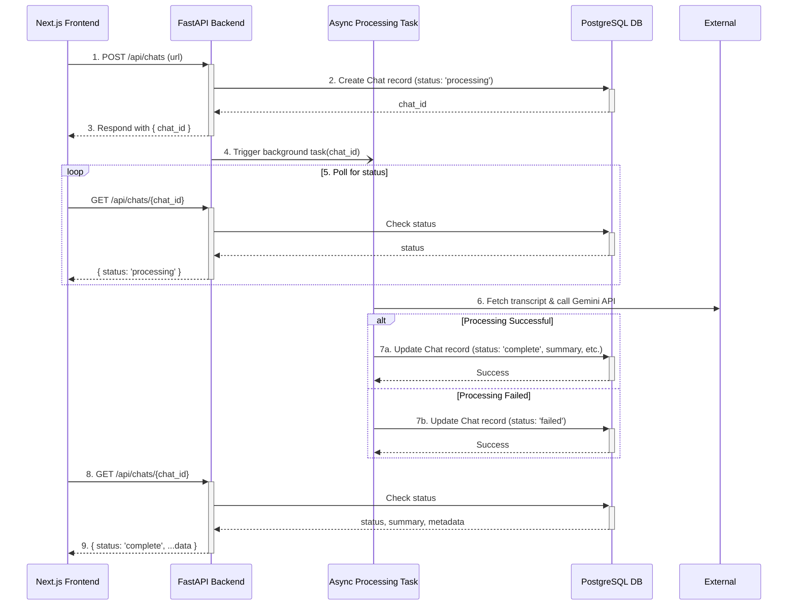
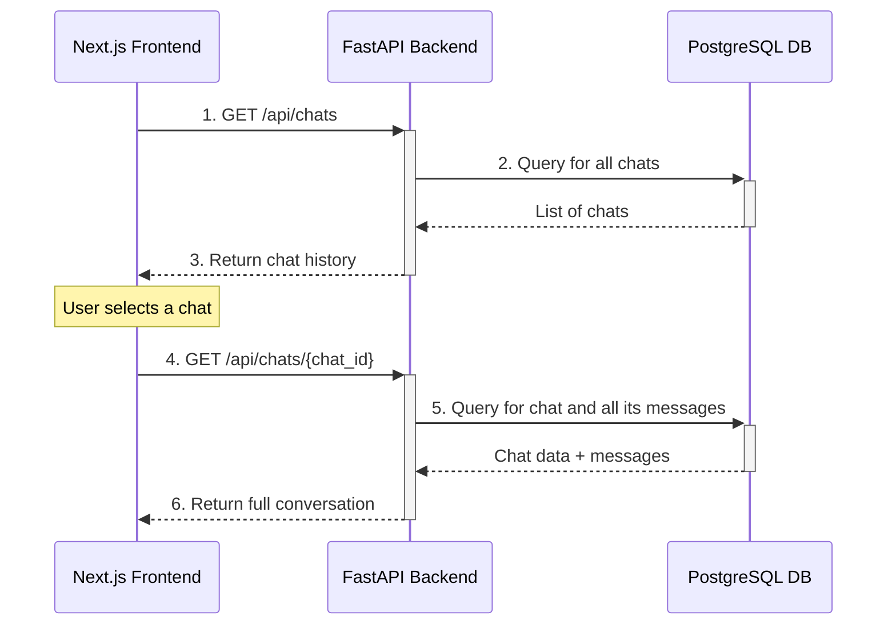

# Chat with Video Architecture Document
## 1. Introduction
This document outlines the overall project architecture for Chat with Video, including backend systems, shared services, and non-UI specific concerns. Its primary goal is to serve as the guiding architectural blueprint for AI-driven development, ensuring consistency and adherence to chosen patterns and technologies.

#### Relationship to Frontend Architecture:
If the project includes a significant user interface, a separate Frontend Architecture Document will detail the frontend-specific design and MUST be used in conjunction with this document. Core technology stack choices documented herein (see "Tech Stack") are definitive for the entire project, including any frontend components.

#### Starter Template or Existing Project
The project is a greenfield application. The frontend will be scaffolded using create-next-app. The backend will be a manual setup from scratch using Python and FastAPI to provide maximum control over the configuration.

## 2. High Level Architecture
#### Technical Summary
The system will be a decoupled, full-stack application structured within a monorepo to facilitate unified development and showcase modern project management. The frontend will be a Next.js application, communicating with a backend API server built with Python and FastAPI. Data persistence will be handled by a PostgreSQL database, managed via Docker for local development consistency. The core logic involves asynchronous processing of YouTube video data, with the Gemini API providing the intelligence for summarization and chat interactions. This architecture directly supports the PRD goals of creating a high-quality, developer-friendly, and interactive portfolio piece.

#### High Level Overview
- **Architectural Style**: Decoupled Client-Server. The Next.js frontend is fully independent of the FastAPI backend, communicating exclusively through a defined API contract. This separation of concerns is crucial for maintainability.

- **Repository Structure**: Monorepo. As required by the PRD, this structure will keep the api and web applications in a single repository, simplifying setup and cross-application type sharing.

- **Service Architecture**: The FastAPI application will serve as a dedicated backend API server. Its responsibilities include handling requests from the frontend, managing database interactions, orchestrating asynchronous jobs for video processing, and securely interfacing with external services like the Gemini API.

- **Primary Data Flow**: A user submits a URL via the Next.js frontend. This triggers a request to the FastAPI backend, which initiates an async job to fetch data from YouTube. The job then sends the transcript to the Gemini API for analysis. The frontend polls the backend for status updates and, upon completion, retrieves the processed data to display to the user.

#### High Level Project Diagram


#### Architectural and Design Patterns
- **Asynchronous Task Processing**: For video transcript retrieval and LLM analysis, we will use FastAPI's background tasks. This prevents blocking the API, allowing us to immediately return a chat_id to the frontend for polling, which directly supports the required user experience.

- **Repository Pattern**: We will implement the repository pattern for database interactions. This will abstract the data access logic from the business logic in our API endpoints, making the code cleaner, easier to test with mocks, and simpler to maintain or migrate in the future.

- **Monorepo**: As specified in the PRD, this pattern will be used to manage the frontend and backend codebases together. This is ideal for a portfolio project, as it allows a contributor to clone a single repository and run the entire stack with minimal friction.

## 3. Tech Stack
#### Cloud Infrastructure
- **Provider**: For the MVP, the primary deployment target is Local, utilizing Docker to ensure a consistent environment that meets the "zero operational budget" requirement. The architecture will be designed to be cloud-ready.
- **Future Recommendation**: Amazon Web Services (AWS).
- **Key Future Services**:
    - **AWS Fargate**: For deploying the containerized FastAPI application without managing servers.
    - **Amazon RDS for PostgreSQL**: For a fully managed, scalable PostgreSQL database.
    - **AWS Secrets Manager**: For securely handling the Gemini API key and other credentials.
- **Deployment Regions**: N/A for local MVP.

#### Technology Stack Table
This table outlines the specific technologies chosen for the backend.

| Category | Technology | Version | Purpose | Rationale |
| --- | --- | --- | --- | --- |
| Language | Python | ~3.12 | Primary backend language | Modern, stable version with broad library compatibility. |
| Framework | FastAPI | ~0.111.0 | Web framework for building APIs | Required by PRD; offers high performance and native async support . |
| LLM Framework | LangChain | ~0.2.0 | High-level framework for orchestrating LLM interactions. | Provides abstractions for chains, prompts, and memory to simplify complex LLM workflows. |
| LLM Integration | langchain-google-genai | ~1.0.0 | LangChain integration for the Gemini API. | The official package for connecting LangChain to our chosen LLM provider. |
| ORM / DB Client | SQLAlchemy | ~2.0 | Database toolkit and Object Relational Mapper | Industry standard for Python; version 2.0 has excellent async support that pairs perfectly with FastAPI. |
| DB Driver | psycopg (v3) | ~3.1 | Modern PostgreSQL driver for Python | Offers superior performance and native async support compared to its predecessor (psycopg2). |
| Data Validation | Pydantic | ~2.7 | Data validation and settings management | Natively integrated into FastAPI for robust, type-hint-based validation of API requests. |
| Dependency Mgmt | Poetry | ~1.8 | Dependency management and packaging | Creates a deterministic, lock-file-based environment, which is superior for reproducibility (supports NFR7) . |
| Testing | pytest | ~8.2 | Testing framework | The de-facto standard for testing in Python; large ecosystem of plugins. |
| Linting/Formatting | Ruff & Black | latest | Code linting and formatting | Ruff is an extremely fast, all-in-one linter. Black is the standard, opinionated code formatter. Together they ensure code quality and consistency. |

## 4. Data Models
This model uses the Chat name for the project's domain, while making the underlying data structure flexible for future providers.

#### Chat
- **Purpose**: This model represents a single, complete analysis session for one source (initially, a YouTube video).

- **Key Attributes**:
    - `id`: `UUID`
    - `source_url`: `TEXT NOT NULL`
    - `source_type`: `VARCHAR(50) NOT NULL` (e.g., 'YOUTUBE')
    - `video_id`: `VARCHAR(255)`
    - `status`: `VARCHAR` - The processing status (e.g., processing, complete, failed). 
    - `title`: `TEXT` - The video's title. 
    - `channel_name`: `VARCHAR` - The name of the YouTube channel. 
    - `publication_date`: `TIMESTAMP` - The date the video was published. 
    - `view_count`: `INTEGER` - The number of views the video has. 
    - `thumbnail_url`: `TEXT` - The URL for the video's thumbnail image. 
    - `transcript`: `TEXT` - The full transcript of the video. 
    - `generated_summary`: `TEXT` - The initial summary generated by the LLM. 
    - `actionable_items`: `JSONB` - A list of actionable items extracted by the LLM. 
    - `suggested_questions`: `JSONB` - A list of suggested questions generated by the LLM. 
    - `created_at`: `TIMESTAMP` - Timestamp of when the record was created.
    - `updated_at`: `TIMESTAMP` - Timestamp of the last update.

- **Relationships**: Has a one-to-many relationship with the ChatMessage model.

#### ChatMessage
- **Purpose**: Stores a single message within a conversation.

- **Key Attributes**:
    - `id`: `UUID` - The primary key for the message.
    - `chat_id`: `UUID` - A foreign key linking to the Chat model.
    - `role`: `VARCHAR` - The author of the message (e.g., 'user' or 'ai').
    - `content`: `TEXT` - The text content of the message.
    - `created_at`: `TIMESTAMP` - Timestamp of when the message was created.

- **Relationships**: Belongs to one Chat model.

## 5. Components
##### API Server
- **Responsibility**: To expose the backend's functionality via a RESTful API.
- **Key Interfaces**:
    - `POST /api/chats`
    - `GET /api/chats/{chat_id}`
    - `GET /api/chats`
    - `POST /api/chats/{chat_id}/messages`
- **Dependencies**: Chat Service, Persistence Service.
- **Technology Stack**: FastAPI, Pydantic.

##### Video Processing Service
- **Responsibility**: To handle all logic related to fetching and preparing video data.
- **Key Interfaces**:
    - `process_video(chat_id, source_url)`
- **Dependencies**: Persistence Service, YouTube Transcript Service (External).
- **Technology Stack**: Python, youtube-transcript-api library.

##### LLM Service
- **Responsibility**: To encapsulate all interactions with the Gemini API using the LangChain framework. It will construct and invoke LangChain "chains" for prompt management, implementing safeguards against prompt injection within these chains.
- **Key Interfaces**:
    - `generate_initial_analysis(transcript)`
    - `get_chat_response_stream(transcript, history, new_question)`
- **Dependencies**: Google Gemini API (External).
- **Technology Stack**: Python, LangChain, langchain-google-genai.

##### Persistence Service (Repository)
- **Responsibility**: To abstract all database operations for the Chat and ChatMessage models.
- **Key Interfaces**:
    - `create_chat(source_url, source_type)`
    - `get_chat_by_id(chat_id)`
    - `update_chat(chat_id, data)`
    - `add_message(message_data)`
- **Dependencies**: SQLAlchemy, psycopg.
- **Technology Stack**: Python, SQLAlchemy.

##### Chat Service
- **Responsibility**: To manage the core business logic of a conversation.
- **Key Interfaces**:
    - `start_new_chat(url)`
    - `post_message(chat_id, message_content)`
- **Dependencies**: Video Processing Service, LLM Service, Persistence Service.
- **Technology Stack**: Python.

#### Component Interaction Diagram



## 6. External APIs
#### Google Gemini API
- **Purpose**: Provides the core generative AI capabilities for video summarization, identifying action items, and powering the interactive chat.
- **Documentation**: https://ai.google.dev/docs
- **Authentication**: API Key. As specified in the PRD, this key must be stored securely in an environment variable on the backend and never exposed to the frontend.
- **Rate Limits**: The free tier of the Gemini API has rate limits (e.g., requests per minute). Our application must handle potential 429 Too Many Requests errors gracefully.
- **Key Endpoints Used**: We will use the gemini-1.5-flash model via the following methods in the Python SDK
    - **generateContent**: For the initial, one-off analysis.
    - **streamGenerateContent**: For the interactive chat to provide a real-time response.
- **Integration Notes**: All interaction with the Gemini API will be encapsulated within the LLM Service component.

#### YouTube Transcript Service
- **Purpose**: To retrieve the machine-generated or user-provided transcript for a given YouTube video. This is the primary context source for the LLM.

- **Documentation**: This will be implemented via a library such as youtube-transcript-api (https://pypi.org/project/youtube-transcript-api/).

- **Authentication**: None required for publicly available videos.

- **Rate Limits**: There are no official, published rate limits. However, making an excessive number of requests in a short period can lead to temporary IP-based blocking. We must consider this a potential operational risk.

- **Key Endpoints Used**: N/A (Library-based). The primary function will be similar to YouTubeTranscriptApi.get_transcript(video_id).

- **Integration Notes**: This functionality will be encapsulated within the Video Processing Service component and run as an asynchronous background task.

## 7. Core Workflows
#### Workflow 1: Processing a New Video
This diagram shows the end-to-end process from a user submitting a URL to the asynchronous processing and analysis being completed.



#### Workflow 2: Continuing a Saved Chat
This diagram shows the simpler flow for a user accessing a previously analyzed video from their history.



## 8. REST API Spec
This OpenAPI 3.0 specification serves as the formal contract between the frontend and the backend.

```yaml
openapi: 3.0.1
info:
  title: "Chat with YouTube Video API"
  version: "1.0.0"
  description: "API for processing YouTube videos and interacting with them via chat."
servers:
  - url: http://localhost:8000
    description: Local development server

paths:
  /api/chats:
    post:
      summary: "Submit a new source URL for processing"
      requestBody:
        required: true
        content:
          application/json:
            schema:
              type: object
              properties:
                source_url:
                  type: string
                  format: uri
                  example: "https://www.youtube.com/watch?v=dQw4w9WgXcQ"
                source_type:
                  type: string
                  example: "YOUTUBE"
      responses:
        '202':
          description: "Accepted for processing. Returns the new chat ID."
          content:
            application/json:
              schema:
                type: object
                properties:
                  chat_id:
                    type: string
                    format: uuid
    get:
      summary: "Get chat history"
      responses:
        '200':
          description: "A list of past chat sessions."
          content:
            application/json:
              schema:
                type: array
                items:
                  $ref: '#/components/schemas/ChatSummary'

  /api/chats/{chat_id}:
    get:
      summary: "Get a specific chat session"
      parameters:
        - name: chat_id
          in: path
          required: true
          schema:
            type: string
            format: uuid
      responses:
        '200':
          description: "The full chat object, including messages."
          content:
            application/json:
              schema:
                $ref: '#/components/schemas/Chat'

  /api/chats/{chat_id}/messages:
    post:
      summary: "Send a message to a chat session"
      parameters:
        - name: chat_id
          in: path
          required: true
          schema:
            type: string
            format: uuid
      requestBody:
        required: true
        content:
          application/json:
            schema:
              type: object
              properties:
                message:
                  type: string
      responses:
        '200':
          description: "A streaming response from the LLM."
          content:
            text/event-stream:
              schema:
                type: string

components:
  schemas:
    ChatMessage:
      type: object
      properties:
        id:
          type: string
          format: uuid
        role:
          type: string
          enum: [user, ai]
        content:
          type: string
        created_at:
          type: string
          format: date-time

    Chat:
      type: object
      properties:
        id:
          type: string
          format: uuid
        status:
          type: string
          enum: [processing, complete, failed]
        title:
          type: string
        channel_name:
          type: string
        publication_date:
          type: string
          format: date-time
        view_count:
          type: integer
        thumbnail_url:
          type: string
          format: uri
        generated_summary:
          type: string
        actionable_items:
          type: array
          items:
            type: string
        suggested_questions:
          type: array
          items:
            type: string
        messages:
          type: array
          items:
            $ref: '#/components/schemas/ChatMessage'

    ChatSummary:
      type: object
      properties:
        id:
          type: string
          format: uuid
        title:
          type: string
        channel_name:
          type: string
        publication_date:
          type: string
          format: date-time
        view_count:
          type: integer
        thumbnail_url:
          type: string
          format: uri
```

## 9. Database Schema
This schema is for PostgreSQL and includes tables, relationships, indexes, and a trigger for managing update timestamps.

```sql
-- The 'uuid-ossp' extension is required for generating UUIDs.
-- This should be enabled in the database: CREATE EXTENSION IF NOT EXISTS "uuid-ossp";

-- Table to store the main chat session and its associated source/analysis data
CREATE TABLE chats (
    id UUID PRIMARY KEY DEFAULT uuid_generate_v4(),
    source_url TEXT NOT NULL,
    source_type VARCHAR(50) NOT NULL,
    video_id VARCHAR(255) NOT NULL,
    status VARCHAR(50) NOT NULL DEFAULT 'processing',
    title TEXT,
    channel_name VARCHAR(255),
    publication_date TIMESTAMPTZ,
    view_count INTEGER,
    thumbnail_url TEXT,
    transcript TEXT,
    generated_summary TEXT,
    actionable_items JSONB,
    suggested_questions JSONB,
    created_at TIMESTAMPTZ NOT NULL DEFAULT NOW(),
    updated_at TIMESTAMPTZ NOT NULL DEFAULT NOW()
);

-- Table to store individual messages within a chat session
CREATE TABLE chat_messages (
    id UUID PRIMARY KEY DEFAULT uuid_generate_v4(),
    chat_id UUID NOT NULL REFERENCES chats(id) ON DELETE CASCADE,
    role VARCHAR(50) NOT NULL, -- 'user' or 'ai'
    content TEXT NOT NULL,
    created_at TIMESTAMPTZ NOT NULL DEFAULT NOW()
);

-- Indexes for performance
CREATE INDEX idx_chats_video_id ON chats(video_id);
CREATE INDEX idx_chat_messages_chat_id ON chat_messages(chat_id);

-- Trigger to automatically update the 'updated_at' timestamp on the 'chats' table
CREATE OR REPLACE FUNCTION trigger_set_timestamp()
RETURNS TRIGGER AS $$
BEGIN
  NEW.updated_at = NOW();
  RETURN NEW;
END;
$$ LANGUAGE plpgsql;

CREATE TRIGGER set_timestamp
BEFORE UPDATE ON chats
FOR EACH ROW
EXECUTE FUNCTION trigger_set_timestamp();
```

## 10. Source Tree
This structure is based on a modern full-stack monorepo approach, separating applications (apps) from shared code (packages).

```
chat-with-vid/
├── apps/
│   ├── api/                  # Python/FastAPI Backend
│   │   ├── app/
│   │   │   ├── __init__.py
│   │   │   ├── main.py         # FastAPI app instance and middleware
│   │   │   ├── api/            # API Routers (Endpoints)
│   │   │   │   └── v1/
│   │   │   │       └── chats.py
│   │   │   ├── core/           # Core logic (config, db session)
│   │   │   ├── models/       # SQLAlchemy ORM models
│   │   │   ├── schemas/        # Pydantic schemas (for API validation)
│   │   │   ├── services/       # Business logic (Chat, LLM, Video Processing)
│   │   │   └── repository/     # Data access layer
│   │   ├── tests/              # Pytest tests
│   │   ├── .env.example
│   │   └── pyproject.toml      # Poetry config for backend
│   │
│   └── web/                  # Next.js Frontend (as per ui-architecture.md)
│       ├── src/
│       │   ├── app/
│       │   ├── components/
│       │   └── lib/
│       ├── .env.local.example
│       └── package.json
│
├── packages/
│   └── shared-types/         # (Optional) For sharing types between FE/BE
│
├── .gitignore
├── docker-compose.yml        # For PostgreSQL database
└── README.md
```

## 11. Infrastructure and Deployment
#### Infrastructure as Code
- **MVP (Local)**: The primary IaC tool will be Docker Compose. The docker-compose.yml file will define and configure the PostgreSQL service.
- **Future (AWS)**: The recommended IaC tool is Terraform.

#### Deployment Strategy
- **MVP (Local)**: Deployment is handled by running docker-compose up.
- **Future (AWS)**: A CI/CD-driven strategy will be implemented using GitHub Actions.

#### Environments
| Environment | Purpose | Details |
|-------------|---------|---------|
| Development | Local development | Run via docker-compose up on a developer's machine. |
| Staging     | Pre-production testing | A mirror of the production environment in AWS. |
| Production  | Live application     | The public-facing application running on AWS. |

#### Environment Promotion Flow
The promotion of code will follow a standard Git-based workflow:
Feature Branch -> Pull Request -> main (triggers Staging deploy) -> Manual Promotion/Tag (triggers Production deploy).

#### Rollback Strategy
- **MVP (Local)**: Rollback is achieved by checking out a previous Git commit.
- **Future (AWS)**: A Blue/Green deployment strategy is recommended.

## 12. Error Handling Strategy
#### General Approach
- **Centralized Exception Handling**: A centralized FastAPI middleware will catch all unhandled exceptions, log them, and format them into a consistent JSON error response.
- **Custom Business Exceptions**: For predictable errors (e.g., invalid URL), we will create custom exception classes that map to specific HTTP status codes.

#### Logging Standards
- **Library**: Python's built-in logging module.
- **Format**: JSON. All logs will be structured for machine readability.
- **Correlation ID**: Every incoming API request will be assigned a unique correlation_id to be included in all log messages for that request's lifecycle.

#### Error Handling Patterns
- **External API Errors**: A retry mechanism with exponential backoff will be used for transient errors from external APIs. All external calls will have a strict timeout.
- **Business Logic Errors**: Custom exceptions will be used to return appropriate HTTP status codes (e.g., 400, 404) with user-friendly messages.

## 13. Coding Standards
#### Core Standards
- **Languages & Runtimes**: All backend code must be written in Python ~3.12.
- **Style & Linting**: All code must be formatted with Black and pass all linting checks from Ruff.
- **Test Organization**: All tests must be located in the apps/api/tests directory and follow the naming convention test_*.py.

#### Naming Conventions
All Python code must strictly adhere to the PEP 8 style guide.

#### Critical Rules
- **Use the Repository Pattern**: All database interactions MUST go through the repository layer.
- **Centralized Exception Handling**: Raise specific, custom business exceptions; do not use generic try...except blocks in the API layer.
- **Structured Logging Only**: All logging MUST use the configured structured logger. Do not use print().
- **Secure API Key Handling**: The Gemini API key MUST only be accessed via a secure configuration service
- **Use LangChain Chains**: All LLM interactions MUST be constructed as LangChain chains (e.g., using LLMChain or Runnables) within the LLM Service. Do not invoke the base LLM directly from the langchain-google-genai package.

## 14. Test Strategy and Standards
#### Testing Philosophy
- **Approach**: All backend development must follow the Test-Driven Development (TDD) methodology, using the "Red-Green-Refactor" cycle.
- **Coverage Goals**: TDD naturally drives test coverage towards 100%. The primary goal is ensuring all functionality is driven by a test.

#### Test Types and Organization
##### Unit Tests
- **Framework**: pytest
- **File Convention**: Tests will be located in the apps/api/tests directory, mirroring the application structure.

- **Mocking Library**: unittest.mock or pytest-mock.

- **AI Agent Requirements**: The AI development agent must follow the TDD cycle for all new functionality:
    - First, generate a new test file or add a new test case to an existing file that clearly defines a requirement and is confirmed to fail.
    - Second, write the application code in the appropriate service or repository to make the failing test pass.
    - Third, review the implemented code for potential refactoring opportunities to improve its structure and readability.

##### Integration Tests
- **Scope**: TDD will also be applied at the integration level, testing the service layer against a real database instance.
- **Test Infrastructure**: A dedicated, containerized PostgreSQL database managed by Docker Compose will be used for tests.

##### Test Data Management
- **Strategy**: pytest fixtures will be used to manage test data, ensuring tests are isolated and repeatable.

##### Continuous Testing
- **CI Integration**: A foundational CI pipeline using GitHub Actions will be implemented as part of the initial project setup. This pipeline will run the entire test suite and all linter checks on every pull request, blocking merges if tests fail. This CI workflow is a core part of the MVP development process and is distinct from the future Continuous Deployment (CD) pipeline discussed in Section 11.

## 15. Security
#### Input Validation
- **Validation Library**: Pydantic. All incoming request data must be validated at the API boundary using Pydantic models.

#### Authentication & Authorization
- **MVP Scope**: The current MVP does not include user authentication or authorization.

#### Secrets Management
- **Development**: The Gemini API key must be stored in a .env file that is included in .gitignore.
- **Production (Future)**: Secrets will be managed by AWS Secrets Manager.

#### API Security
- **CORS Policy**: The API must be configured to only allow requests from the specific origin of the frontend application.
- **Security Headers**: Middleware should be added to include standard security headers.

#### Data Protection
- **Encryption in Transit**: All future production deployments must enforce HTTPS.
- **PII Handling**: This application does not handle Personally Identifiable Information (PII).
- **Logging Restrictions**: No sensitive data may be written to logs.

#### Dependency Security
- **Scanning Tool**: The project will use GitHub's Dependabot to automatically scan for known vulnerabilities.