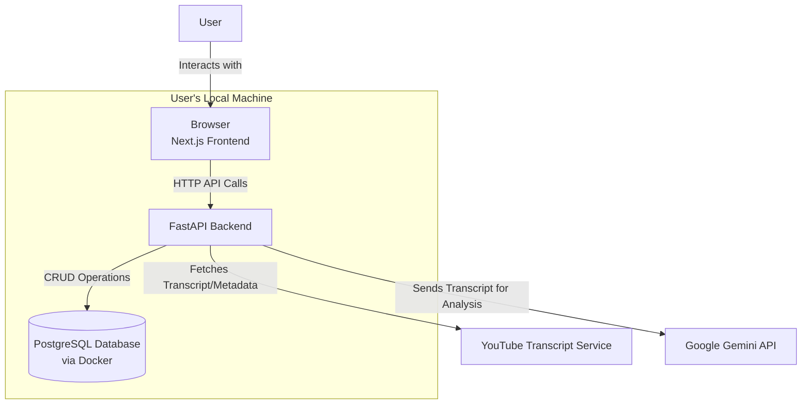

# 2. High Level Architecture
### Technical Summary
The system will be a decoupled, full-stack application structured within a monorepo to facilitate unified development and showcase modern project management. The frontend will be a Next.js application, communicating with a backend API server built with Python and FastAPI. Data persistence will be handled by a PostgreSQL database, managed via Docker for local development consistency. The core logic involves asynchronous processing of YouTube video data, with the Gemini API providing the intelligence for summarization and chat interactions. This architecture directly supports the PRD goals of creating a high-quality, developer-friendly, and interactive portfolio piece.

### High Level Overview
- **Architectural Style**: Decoupled Client-Server. The Next.js frontend is fully independent of the FastAPI backend, communicating exclusively through a defined API contract. This separation of concerns is crucial for maintainability.

- **Repository Structure**: Monorepo. As required by the PRD, this structure will keep the api and web applications in a single repository, simplifying setup and cross-application type sharing.

- **Service Architecture**: The FastAPI application will serve as a dedicated backend API server. Its responsibilities include handling requests from the frontend, managing database interactions, orchestrating asynchronous jobs for video processing, and securely interfacing with external services like the Gemini API.

- **Primary Data Flow**: A user submits a URL via the Next.js frontend. This triggers a request to the FastAPI backend, which initiates an async job to fetch data from YouTube. The job then sends the transcript to the Gemini API for analysis. The frontend polls the backend for status updates and, upon completion, retrieves the processed data to display to the user.

### High Level Project Diagram

### Architectural and Design Patterns
- **Asynchronous Task Processing**: For video transcript retrieval and LLM analysis, we will use FastAPI's background tasks. This prevents blocking the API, allowing us to immediately return a chat_id to the frontend for polling, which directly supports the required user experience.

- **Repository Pattern**: We will implement the repository pattern for database interactions. This will abstract the data access logic from the business logic in our API endpoints, making the code cleaner, easier to test with mocks, and simpler to maintain or migrate in the future.

- **Monorepo**: As specified in the PRD, this pattern will be used to manage the frontend and backend codebases together. This is ideal for a portfolio project, as it allows a contributor to clone a single repository and run the entire stack with minimal friction.
