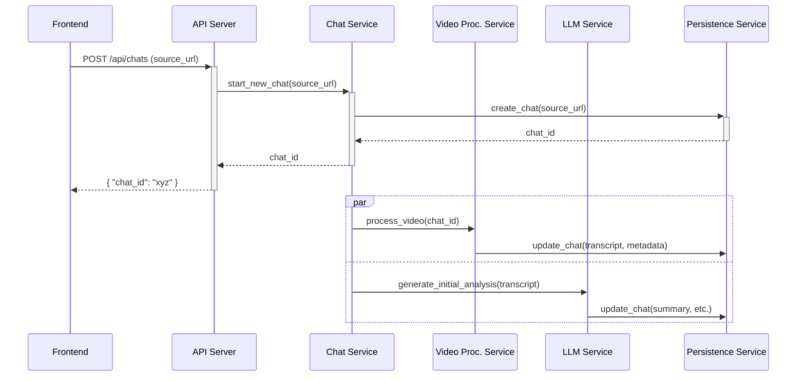

# 5. Components
#### API Server
- **Responsibility**: To expose the backend's functionality via a RESTful API.
- **Key Interfaces**:
    - `POST /api/chats`
    - `GET /api/chats/{chat_id}`
    - `GET /api/chats`
    - `POST /api/chats/{chat_id}/messages`
- **Dependencies**: Chat Service, Persistence Service.
- **Technology Stack**: FastAPI, Pydantic.

#### Video Processing Service
- **Responsibility**: To handle all logic related to fetching and preparing video data.
- **Key Interfaces**:
    - `process_video(chat_id, source_url)`
- **Dependencies**: Persistence Service, YouTube Transcript Service (External).
- **Technology Stack**: Python, youtube-transcript-api library.

#### LLM Service
- **Responsibility**: To encapsulate all interactions with the Gemini API using the LangChain framework. It will construct and invoke LangChain "chains" for prompt management, implementing safeguards against prompt injection within these chains.
- **Key Interfaces**:
    - `generate_initial_analysis(transcript)`
    - `get_chat_response_stream(transcript, history, new_question)`
- **Dependencies**: Google Gemini API (External).
- **Technology Stack**: Python, LangChain, langchain-google-genai.

#### Persistence Service (Repository)
- **Responsibility**: To abstract all database operations for the Chat and ChatMessage models.
- **Key Interfaces**:
    - `create_chat(source_url, source_type)`
    - `get_chat_by_id(chat_id)`
    - `update_chat(chat_id, data)`
    - `add_message(message_data)`
- **Dependencies**: SQLAlchemy, psycopg.
- **Technology Stack**: Python, SQLAlchemy.

#### Chat Service
- **Responsibility**: To manage the core business logic of a conversation.
- **Key Interfaces**:
    - `start_new_chat(url)`
    - `post_message(chat_id, message_content)`
- **Dependencies**: Video Processing Service, LLM Service, Persistence Service.
- **Technology Stack**: Python.

### Component Interaction Diagram

