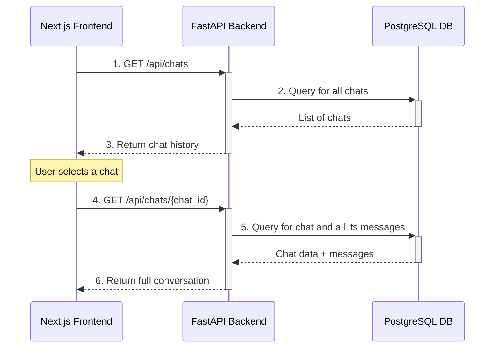

# 7. Core Workflows
### Workflow 1: Processing a New Video
This diagram shows the end-to-end process from a user submitting a URL to the asynchronous processing and analysis being completed.

### Workflow 2: Continuing a Saved Chat
This diagram shows the simpler flow for a user accessing a previously analyzed video from their history.

