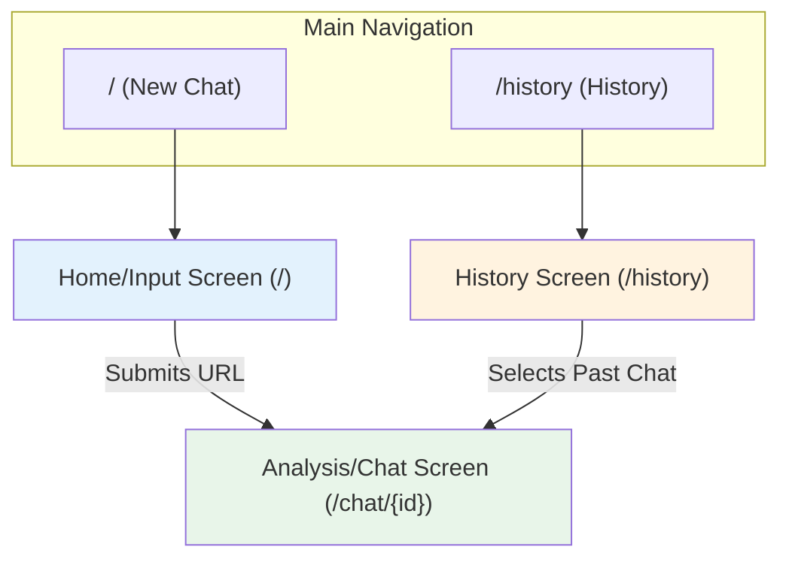
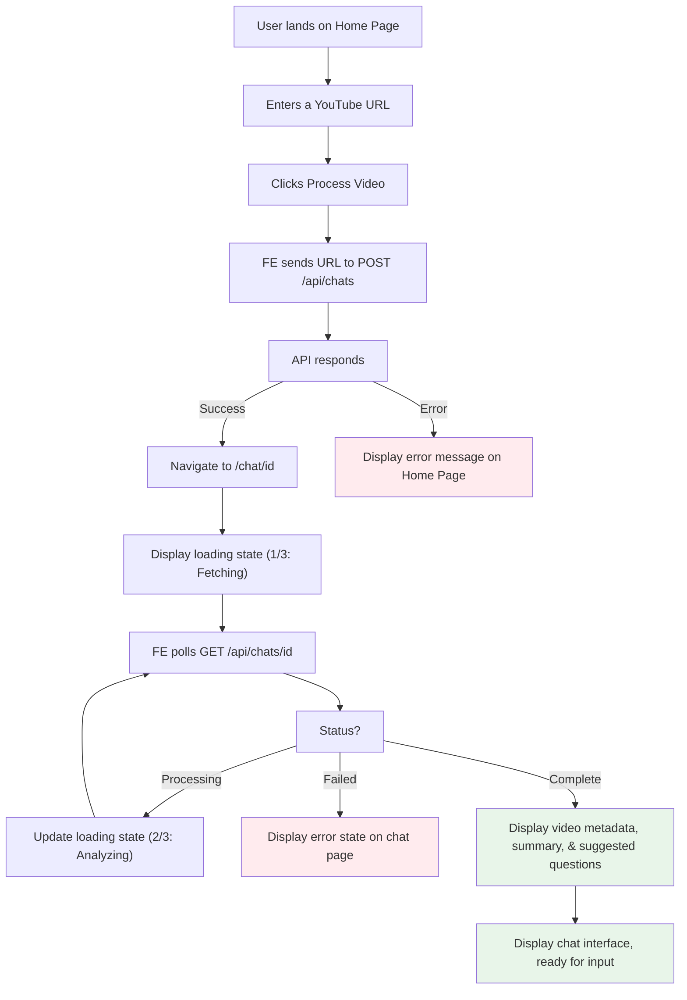
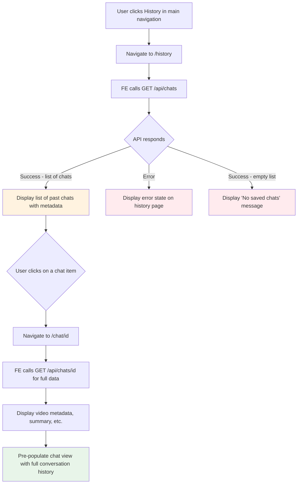

# Chat with Video UI/UX Specification
## Introduction
This document defines the user experience goals, information architecture, user flows, and visual design specifications for the Chat with YouTube Video's user interface. It serves as the foundation for visual design and frontend development, ensuring a cohesive and user-centered experience.

#### Overall UX Goals & Principles
Based on the PRD, our design will be guided by the following principles to ensure a clean, fast, and conversational experience.

#### User Personas
**The Efficient Learner**: This persona represents students, researchers, and professionals who need to extract specific information from video content quickly and without friction. They value speed, accuracy, and intuitive interfaces.

#### Usability Goals
- **Efficiency of Use**: Users can get from a Video URL to an interactive chat in under 10 seconds.
- **Ease of Learning**: A first-time user can understand and use the core functionality (URL submission and chat) with zero instruction.
- **Immediate Feedback**: The system provides clear, continuous feedback on its status, from processing steps to the streaming of AI responses.
- **Memorability**: The interface is simple and conventional enough that an infrequent user can return and use it without relearning the process.

#### Design Principles
- **Clarity Above All**: The interface will be minimalist and prioritize clear communication. We will avoid any ambiguity that could slow the user down.
- **Conversational Flow**: The design will mimic a natural messaging experience, making the interaction with the AI feel intuitive and familiar.
- **Progressive Disclosure**: Show only what's needed, when it's needed. The UI will guide the user step-by-step, revealing the chat interface and suggested questions only after the initial analysis is complete.
- **Frictionless Interaction**: Every step, from pasting a URL to clicking a suggested question, will be optimized to require the minimum possible effort.

## Information Architecture (IA)
The application will have a simple, flat architecture with three primary views, ensuring users can navigate intuitively between creating a new chat and reviewing their history.

#### Site Map / Screen Inventory
This diagram shows the main screens and the primary user paths between them.

#### Navigation Structure
- **Primary Navigation**: A persistent header will be present on all screens - containing two main links:
    - **New Chat**: Navigates the user to the Home/Input screen (/).
    - **History**: Navigates the user to the Chat History screen (/history).
- **Secondary Navigation**: Not required due to the simple, flat hierarchy of the application.
- **Breadcrumb Strategy**: Not required.

## User Flows
The following diagrams illustrate the step-by-step paths users will take to accomplish key tasks within the application.

#### Processing a New Video
This is the primary user flow, taking the user from submitting a URL to engaging in a conversation.
**User Goal**: To get an interactive summary and chat interface for a specific YouTube video.
**Entry Points**: The user lands on the Home/Input screen (/).
**Success Criteria**: The user is presented with the generated summary, suggested questions, and a fully functional chat interface for the submitted video.

##### Flow Diagram

##### Edge Cases & Error Handling:
- **Invalid URL**: If the user submits a URL that is not a valid YouTube link, the backend API should reject it, and the frontend will display an inline error message without leaving the page.
- **Processing Failure**: If the backend fails to retrieve the transcript or the LLM analysis fails, the polling status will update to "failed," and the chat page will display a clear error message with a suggestion to try another video.
- **Long Processing Time**: The UI must comfortably handle extended polling periods for very long videos without timing out, continually showing the user that work is happening in the background.

#### Viewing a Past Conversation
This flow describes how a user can find and reopen a previously saved chat session.

**User Goal**: To review or continue a previous conversation with a video.

**Entry Points**: The user clicks the "History" link in the primary navigation.

**Success Criteria**: The user successfully loads the Analysis/Chat screen for a past session, with the full conversation history accurately displayed.

##### Flow Diagram

##### Edge Cases & Error Handling:
- **No History**: If the user has not processed any videos yet, the history page will display a clear, friendly message encouraging them to start a new analysis.
- **Error Loading History**: If the GET /api/chats endpoint fails, the history page will show a general error message with a "Retry" button.
- **Error Loading Specific Chat**: If the user clicks a chat from the history, but the GET /api/chats/{id} endpoint for that specific chat fails, the application will show an error on the chat page rather than crashing.

## Wireframes & Mockups
This section provides conceptual, low-fidelity layouts for the core screens of the application.

**Primary Design Files**: For the initial MVP, this document will serve as the primary reference. High-fidelity mockups in a design tool like Figma are recommended for future iterations.

#### Key Screen Layouts
##### Home/Input Screen (`/`)
- **Purpose**: To provide a clear, single-action starting point for the user.

- **Key Elements**:
    - A centered container/card on the page.
    - A prominent heading (e.g., "Chat with any YouTube Video").
    - A single, full-width text input field with a clear label ("Enter YouTube URL").
    - A primary call-to-action button ("Process Video").

- **Interaction Notes**: The page is static. The only interaction is entering a URL and clicking the button. Error messages will appear below the input field if submission fails.

- **Layout**:
    - **Desktop & Mobile**: A single, centered column layout that is clean and focused.

##### Analysis/Chat Screen (`/chat/{id}`)
- **Purpose**: To present the video analysis and provide the core chat interface.

- **Key Elements**:
    - **Video Context Area**: Displays the embedded video player and key metadata (title, channel, etc.).
    - **Analysis Area**: The most prominent section, initially showing the AI-generated summary, actionable items, and clickable suggested questions.
    - **Chat Area**: A standard chat interface with a scrolling conversation history and a text input field at the bottom. The "Stop Generating" button appears here when the AI is responding.

- **Interaction Notes**: Suggested questions are buttons that, when clicked, submit the question to the chat. The chat input is disabled until the initial analysis is complete.

- **Layout (Responsive)**:

    - **Mobile (Default)**: A single-column layout, stacked vertically in order of importance:
        - Analysis Area (Summary & Suggested Questions)
        - Chat Area
        - Video Context Area

    - **Desktop (e.g., > 768px)**: A two-column layout:
        - **Left Column (Wider, ~65%)**: Contains the Analysis Area and the Chat Area below it.
        - **Right Column (Narrower, ~35%)**: Contains the Video Context Area. This keeps the video visible for reference during the chat.

##### History Screen (`/history`)
- **Purpose**: To allow users to browse and reopen past conversations.
- **Key Elements**:
    - A clear heading (e.g., "Conversation History").
    - A list or grid of "Chat Cards."
    - Each card will display the video's thumbnail, title, channel name, view count and relative published date, as required by FR7.

- **Interaction Notes**: Clicking anywhere on a card navigates the user to the corresponding Analysis/Chat screen (/chat/{id}).

- **Layout**:
    - **Mobile**: A single-column list of cards.
    - **Desktop**: A responsive grid of cards (e.g., 2-3 columns).

## Component Library / Design System
This section identifies the foundational UI components required to build the interface, based on the wireframes defined previously.

#### Design System Approach
**Recommendation**: Use a pre-existing component library, specifically Shadcn/ui.

This is a modern, popular choice in the React/Next.js ecosystem. It's not a typical library; instead, you copy and paste well-architected, accessible, and unstyled components into your own project and then style them. This approach gives us maximum customization with minimal overhead, which is perfect for a high-quality portfolio project.

#### Core Components
This is a preliminary list of the essential components we'll need for the MVP.

1. Button
    - **Purpose**: Used for all primary actions like "Process Video," "Stop Generating," and the clickable suggested questions.
    - **Variants**: Primary (for main CTAs), Secondary/Ghost (for less prominent actions).
    - **States**: Default, Hover, Focused, Disabled, Loading.

2. Input
    - **Purpose**: Used for the YouTube URL submission field.
    - **Variants**: Standard text input.
    - **States**: Default, Focused, Error (with an associated error message).

3. Card
    - **Purpose**: A container for grouping related content. It will be used for the main input on the Home screen and for each item in the History list.
    - **Variants**: Default.
    - **States**: Default, Hover (for history items).

4. Chat Message
    - **Purpose**: To display individual messages in the conversation history.
    - **Variants**: User Message (e.g., aligned right), AI Message (e.g., aligned left with a different background color).
    - **States**: Default.

5. Loading Indicator
    - **Purpose**: To provide feedback during asynchronous operations, specifically for the multi-step video processing.
    - **Variants**: A spinner or skeleton loader for the analysis section, and a smaller indicator for the "generating response" state.
    - **States**: Visible/Hidden.

## Branding & Style Guide
This section defines the visual style for the application, focusing on a clean, modern, and trustworthy aesthetic that prioritizes readability and usability in both light and dark modes.

#### Visual Identity
**Brand Guidelines**: As this is a new project, this document will serve as the initial, minimal style guide for the MVP. The application will support both light and dark themes, defaulting to the user's system preference.

#### Color Palette
The following palette defines the colors for both themes. The light theme uses soft off-whites to reduce glare and improve visual comfort.

| Color Type | Usage | Light Mode Hex | Dark Mode Hex |
| --- | --- | --- | --- |
| Primary | Interactive elements | #3B82F6 | #60A5FA |
| Neutral | Main body text | #111827 | #F9FAFB |
| Neutral-Subtle | Secondary text, metadata | #6B7280 | #9CA3AF |
| Background | Main page background | #F9FAFB | #111827 |
| Background-Alt | Cards, AI messages | #FFFFFF | #1F2937 |
| Border | Borders, dividers | #F3F4F6 | #374151 |
| Success | Positive feedback | #10B981 | #34D399 |
| Error | Error messages | #EF4444 | #F87171 |

#### Typography
- **Font Families**: To maximize performance and ensure a clean look, we will use a system font stack. This avoids loading custom fonts and uses the default, optimized font of the user's operating system (e.g., Segoe UI on Windows, San Francisco on macOS).

- **Type Scale**: A responsive type scale will be used to ensure readability across devices.

| Element | Size (Mobile) | Size (Desktop) | Weight |
| --- | --- | --- | --- |
| H1 | 24px | 30px | Bold (700) |
| H2 | 20px | 24px | Bold (700) |
| H3 | 18px | 20px | Semi-Bold (600) |
| Body | 16px | 16px | Normal (400) |
| Small | 14px | 14px | Normal (400) |

#### Iconography
- **Icon Library**: Lucide Icons. This is a clean, modern, and extensive open-source library that integrates perfectly with React and Shadcn/ui.

- **Usage Guidelines**: Icons should be used sparingly to support text labels, not replace them. They should always have clear visual meaning and be consistent in style (e.g., all line-based).

#### Spacing & Layout
- **Grid System**: An 8-point grid system will be used. All spacing values (margins, padding, gaps) should be multiples of 8px (e.g., 8, 16, 24, 32). This ensures consistent and harmonious rhythm throughout the UI.

## Accessibility Requirements
To ensure the application is usable by the widest possible audience, the following requirements will be met, aligning with the WCAG 2.1 Level AA compliance target.

#### Compliance Target
Standard: WCAG 2.1 Level AA

#### Key Requirements
**Visual**
- **Color Contrast**: Text and interactive elements must have a color contrast ratio of at least 4.5:1 against their background.

- **Focus Indicators**: All interactive elements (links, buttons, inputs) must have a clear and visible focus indicator when navigated to via a keyboard.

- **Text Sizing**: Users must be able to resize text up to 200% without loss of content or functionality.

**Interaction**
- **Keyboard Navigation**: All functionality must be operable using only a keyboard. The tab order must be logical and intuitive.

- **Screen Reader Support**: The application will use semantic HTML to ensure it is properly interpreted by screen readers. All interactive elements will have accessible names.

- **Touch Targets**: On mobile devices, all touch targets will be at least 44x44 pixels to be easily tappable.

**Content**
- **Alternative Text**: All meaningful images (like video thumbnails) must have descriptive alternative text (alt text).

- **Heading Structure**: Pages will use a logical heading structure (one `<h1>`, followed by `<h2>`, etc.) to facilitate navigation.

- **Form Labels**: All form inputs will have programmatically associated labels for clarity.

**Testing Strategy**
- We will use a combination of automated tools (like Axe DevTools) to catch common issues and manual testing to ensure a truly usable experience. Manual testing will include navigating the entire application using only a keyboard and testing with a screen reader (e.g., NVDA, VoiceOver).

## Responsiveness Strategy
The application will be fully responsive, ensuring a seamless and optimized experience across a range of devices, from mobile phones to desktops.

#### Breakpoints
We will use a simple, two-breakpoint system for the MVP to ensure a consistent experience without overcomplicating the implementation.

| Breakpoint | Min Width | Target Devices |
| --- | --- | --- |
| Mobile | 0px | Phones (Portrait & Landscape) |
| Desktop | 768px | Tablets, Laptops, Desktops |

#### Adaptation Patterns
- **Layout Changes**: The primary layout adaptation occurs on the Analysis/Chat Screen.
- **Mobile**: It will use a single-column, stacked layout prioritizing the analysis and chat.
- **Desktop (>768px)**: It will switch to the two-column layout we defined in the wireframes, with the main content on the left and the video context on the right.
- **Navigation Changes**: The primary header navigation will remain consistent. On mobile, the padding may be reduced to maximize screen space.
- **Content Priority**: The single-column mobile layout will stack content vertically in order of importance, ensuring the most valuable information is visible without scrolling.
- **Interaction Changes**: All interactive elements will meet the 44x44 pixel touch target size on mobile to ensure ease of use.

## Animation & Micro-interactions
Motion will be used sparingly to enhance the user experience by providing feedback, guiding attention, and creating a smoother, more polished feel.

#### Motion Principles
- **Purposeful**: All animations must have a clear purpose, such as indicating a state change or providing feedback. We will avoid purely decorative motion.
- **Subtle & Quick**: Animations will be fast (typically 150-300ms) and subtle, ensuring they enhance the interface without ever getting in the user's way.
- **Performance-First**: We will prioritize animations that are hardware-accelerated (using CSS transform and opacity) to ensure a smooth, jank-free experience.

#### Key Animations
- **Streaming Chat Response**: As the AI's response streams in, each new token will have a very quick fade-in effect. This will make the text appear to flow in smoothly rather than just appearing abruptly.
- **Loading State Indicator**: The ellipsis (...) on the loading messages (e.g., "Analyzing content...") will have a subtle pulsing animation to visually confirm that the system is actively working.
- **Interactive Element Feedback**: Buttons, links, and input fields will have a quick, subtle transition on their hover and focus states to make the UI feel more responsive and tactile.
- **Page Transitions**: A simple, quick cross-fade transition will be applied when navigating between the main pages (Home, Chat, History) to make the experience feel less jarring.

## Performance Considerations
Performance is a critical component of the user experience. The application must feel fast and responsive, especially during data-intensive operations like video analysis and chat streaming.

#### Performance Goals
These goals are based on the non-functional requirements in the PRD (NFR2).

- **Page Load**: The initial page load time (Largest Contentful Paint) should be under 2.5 seconds.

- **Interaction Response**: Chat responses from the AI must begin streaming in under 3 seconds.

- **Animation FPS**: All animations and transitions must maintain a consistent 60 frames per second (FPS) to feel smooth.

#### Design Strategies
The following strategies will be employed to meet our performance goals:

- **Image Optimization**: Video thumbnails on the history page will be appropriately sized and lazy-loaded to avoid slowing down the initial page render.

- **Minimize Bundle Size**: We will be mindful of dependencies to keep the JavaScript bundle size small, leading to faster load times.

- **Leverage Streaming**: The design fully embraces the streaming of chat responses. This dramatically improves perceived performance, as the user sees activity almost immediately rather than waiting for the full response to be generated.